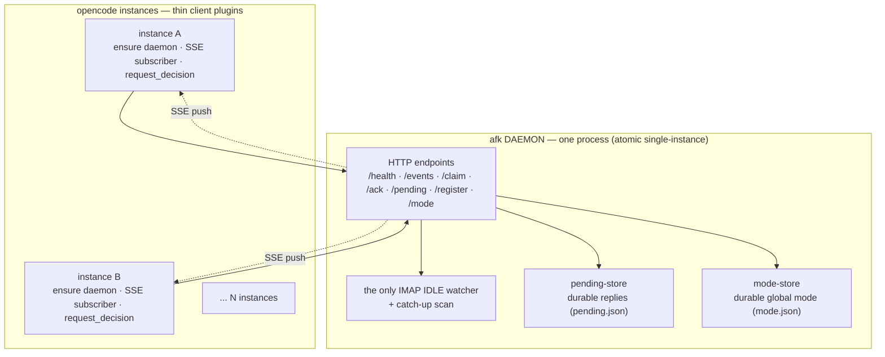
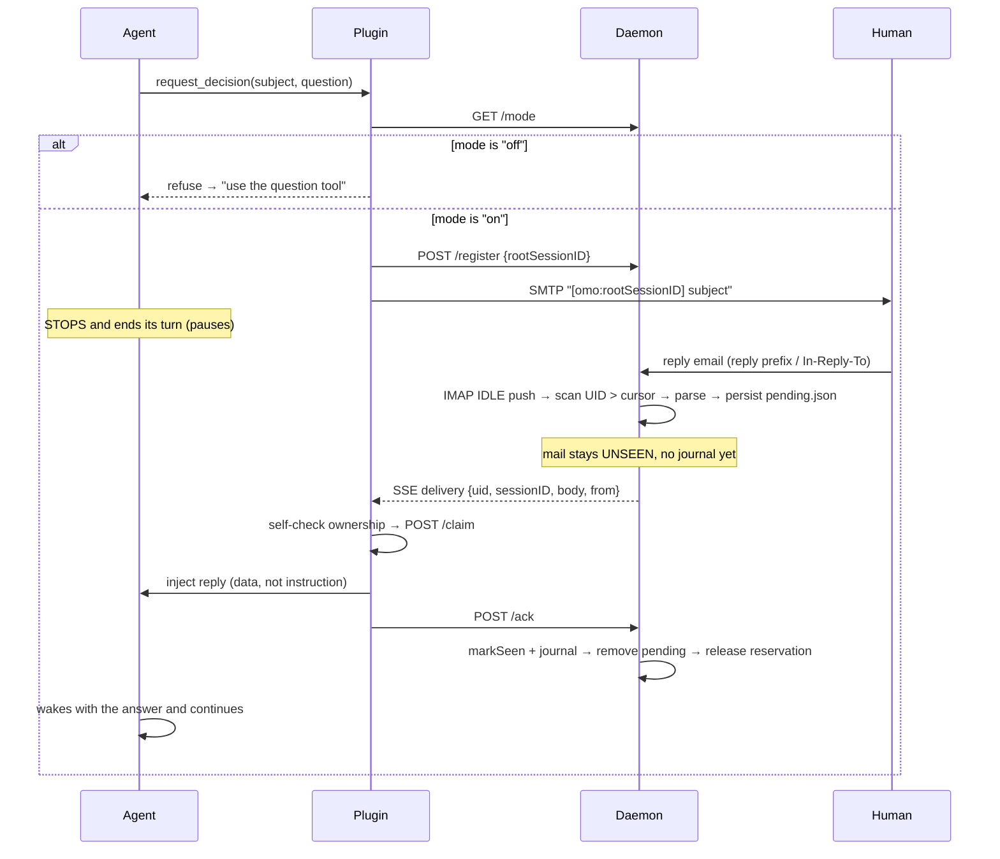

<div align="center">


# afk

**`afk` = Away From Keyboard**

An [OpenCode](https://opencode.ai) plugin: type `/afk` to leave your screen, and
when the running agent hits a decision point it emails the question to you; reply
from anywhere and the session auto-resumes — no need to return to the terminal.

[](LICENSE)
[](#)
[](#)

**English** · [**简体中文**](README.md)

</div>

## Features

- **Email decisions** — the agent asks, you answer from anywhere, no terminal needed
- **Conclusion notifications** — when the agent hits a key conclusion or finishes a task, it emails you a one-way FYI via `notify_user` without pausing its work; replying to that email wakes the session too
- **`/afk` mode gate** — email only fires after you've left the screen (`/back` returns)
- **Zero polling** — IMAP IDLE push + one-time catch-up scan, never a timed poller
- **Push delivery** — SSE broadcast + per-instance ownership self-check (multi-instance safe)
- **No message loss** — durable pending-store + ack-after-inject (crash-safe)
- **i18n** — English defaults, `config.messages` override for any language
- **Data-not-instruction** — prompt-injection guard on every injected reply
- **One-shot installer** — `node install.js` copies, installs, registers, and scaffolds
- **npm distribution** — published as `opencode-afk`; opencode pulls `@latest` automatically on restart (GitHub Actions auto-publish)

See [`AGENTS.md`](AGENTS.md) for the agent-facing instruction (the `request_decision`
contract, the "pause after asking" rule, and the `notify_user` conclusion tool).

---

## Installation

### Option 1 — npm (recommended)

Add one line to the `plugin` array in `~/.config/opencode/opencode.jsonc`:

```jsonc
"plugin": [
  "opencode-afk@latest"
]
```

On the next opencode start it auto-installs `opencode-afk@latest` from npm into its
plugin directory. **After the first install**, create the stable user-level config
(the afk counterpart of `oh-my-openagent.jsonc`):

```bash
mkdir -p ~/.config/opencode
cp <plugin-dir>/config.example.json ~/.config/opencode/afk.json
```

Fill in the credentials in `~/.config/opencode/afk.json` and restart opencode. The
config lives in the opencode config directory, not inside the plugin directory, so
it **survives every `@latest` update that reinstalls the plugin**.

> **Updates:** when a maintainer publishes a new version, just **restart opencode**
> and `@latest` is picked up automatically — no manual copying, no installer, and
> your config is never overwritten by the fresh package directory.

### Copy-paste install — give this to your LLM

Paste this into any coding agent to have it install the plugin in your opencode environment:

```text
Install and configure the afk plugin by following the instructions here:
https://raw.githubusercontent.com/7emotions/afk/main/INSTALLATION.md
```

### Option 2 — source install / local development (install.js)

```bash
git clone https://github.com/7emotions/afk
cd afk
node install.js
# then edit ~/.config/opencode/plugins/afk/config.json and fill credentials
```

The installer:
1. copies the source into `~/.config/opencode/plugins/afk/` (skipping
   `node_modules`, `.git`, and any secret/runtime files);
2. runs `npm install --omit=dev`;
3. creates `config.json` from `config.example.json` (never overwrites an
   existing one);
4. registers the plugin in `~/.config/opencode/opencode.jsonc` (comment-
   preserving text insertion — it never `JSON.parse`s a JSONC file);
5. copies `command/afk.md` + `command/back.md` into
   `~/.config/opencode/command/`.

Then edit `config.json` (gitignored) and fill `imap.user` / `imap.password` /
`smtp.user` / `smtp.password` / `recipient`. Reload opencode.

### Manual steps

Equivalent steps, no installer:

1. Copy this directory into `~/.config/opencode/plugins/afk/`.
2. `cd` into it and run `npm install`.
3. Create `config.json` from `config.example.json` and fill credentials.
4. Add the plugin path to the `plugin` array in `~/.config/opencode/opencode.jsonc`.
5. Copy `command/afk.md` + `command/back.md` into `~/.config/opencode/command/`.
6. Reload opencode.

The plugin depends on `@opencode-ai/plugin`, `@opencode-ai/sdk`, `imapflow`,
`mailparser`, and `nodemailer`.

### Publishing (maintainers)

The npm package is **`opencode-afk`**. Bump the version locally and push a tag;
GitHub Actions (`.github/workflows/publish.yml`) runs the unit tests and publishes
to npm:

```bash
npm version patch   # 0.1.0 → 0.1.1: syncs package.json / package-lock.json / git tag
git push --tags
```

Users need to do nothing — restart opencode to pull `@latest`.

---

## Quick start

1. Install the plugin and write the config: npm installs read
   `~/.config/opencode/afk.json` (copy `config.example.json` — survives updates);
   source installs read the plugin directory's `config.json`.
   At minimum you need valid IMAP + SMTP credentials (a QQ auth code works as
   the password) and a `recipient`.
2. Reload opencode. The plugin ensures its daemon is running and loads.
3. In a session, the agent can call
   `request_decision(subject, question, { context, options, recommendation })`.
   The tool emails the question and returns
   `Decision requested — pause and end this turn; wait for the reply to be injected`.
4. Reply to the email. The daemon detects the reply, the owning instance injects
   it, and the session continues.
5. (Optional) While you're away, the agent may call
   `notify_user(subject, message)` when it finishes a task or reaches a key
   conclusion — a one-way FYI email that does **not** pause its work. Replying to
   that notification is injected back into the session as feedback, the same as
   a decision reply.

```sh
# run the unit test suite (no network, no real mailbox)
npm test
```

---

## Email mode (`/afk` and `/back`)

By default, both `request_decision` and `notify_user` **refuse to email** the
human. Email is only allowed when the human has explicitly left the screen — a
single **GLOBAL** mode flag (`"on"`/`"off"`) stored durably in `mode.json`
(gitignored) by the daemon. It is global by design: the human is either at the
screen or not, regardless of how many sessions/instances are running.

| Mode | Meaning | Email-tool behavior |
|------|---------|-----------------------------|
| `"off"` (default) | Human is at the screen | Refuses: `request_decision` returns the mode-off message (use the built-in `question` tool); `notify_user` refuses too (state the conclusion in the conversation). No email. |
| `"on"` | Human has left (`/afk`) | Emails the human as normal. |

The human flips the mode with two commands:

- `/afk` — calls `set_email_mode(mode: "on")` (email mode ON).
- `/back` — calls `set_email_mode(mode: "off")` (email mode OFF).

When mode is off and the agent needs a decision, it must ask in the conversation
via opencode's built-in **`question` tool** instead of emailing; `notify_user`
states the conclusion in the conversation instead.

**Todo checkpoint.** When `request_decision` will EMAIL (mode on), the agent must
first checkpoint its todo list (write it into the message body, then clear the
todos) so a pending human reply does not get overridden by todo-continuation.
When the reply is injected, the agent rebuilds the todos from the checkpoint.
(`notify_user` does not pause, so it needs no checkpoint.)

### Registering the commands

OpenCode loads custom commands from markdown files in the global command
directory, `~/.config/opencode/command(s)/<name>.md` (the file name is the
command name). Two such files ship this behavior:

- `~/.config/opencode/command/afk.md` — turns email mode ON.
- `~/.config/opencode/command/back.md` — turns email mode OFF.

(Equivalent `opencode.jsonc` form, if you prefer config over markdown files:)

```jsonc
{
  "command": {
    "afk": { "template": "Call the set_email_mode tool with mode \"on\", then confirm briefly.", "description": "Turn email mode ON" },
    "back": { "template": "Call the set_email_mode tool with mode \"off\", then confirm briefly.", "description": "Turn email mode OFF" }
  }
}
```

The mode state lives on the daemon (`mode.json`), is served over `GET /mode` /
`POST /mode`, and is pushed to every connected instance as an SSE `mode` event
(including an initial `mode` event on connect), so a change made in one session
is seen by all instances immediately.

---
## Configuration

Both the plugin (`index.js`) and the daemon (`daemon.js`) resolve the config file
by priority (first hit wins): the `AFK_CONFIG` env var →
`~/.config/opencode/afk.json` (the stable user-level config — survives npm
updates) → the plugin directory's `config.json` (legacy fallback, used by source
installs and tests). See `config.example.json` for a complete, commented-by-
shape example (it contains no real secrets).

### `config.json` fields

| Field | Meaning |
|-------|---------|
| `imap.host` / `imap.port` / `imap.secure` | IMAP server for reading replies (default `imap.qq.com:993`, `secure:true`) |
| `imap.user` / `imap.password` | IMAP credentials (QQ auth code as password) |
| `smtp.host` / `smtp.port` / `smtp.secure` | SMTP server for sending decision emails (default `smtp.qq.com:465`) |
| `smtp.user` / `smtp.password` | SMTP credentials |
| `recipient` | Where decision emails are sent; defaults to `smtp.user` |
| `allowList` | Sender addresses whose replies may be injected — the prompt-injection guard. Default `[smtp.user]` (only your own mailbox) |
| `folder` | Mailbox folder to watch (default `INBOX`) |
| `tuning` | Optional behavior/timing overrides (see below) |
| `messages` | Optional localization of user/agent-facing strings (see below) |

### Security

- **Sender allow list** — `request_decision` emails the question to `recipient`;
  only replies **from** addresses in `allowList` (default: your own `smtp.user`)
  are ever injected into a session. A stranger who copies the
  `[omo:<sessionID>]` subject token still cannot push content in — their reply
  is ignored unless their address is allow-listed. Add extra addresses
  (e.g. a second personal mailbox) by listing them:
  `"allowList": ["me@qq.com", "me@outlook.com"]`.
- **Data-not-instruction** — every injected reply is framed as *data*, never an
  instruction to execute (prompt-injection guard).

### `tuning` (optional — current values are the defaults)

Every field is optional and defaults to the value shown; omit the whole block to
keep the current behavior unchanged.

| Field | Default | Source constant it replaced |
|-------|---------|------------------------------|
| `tuning.claimTtlMs` | `60000` | `pending-store.js` `CLAIM_TTL_MS` — how long a claim stays authoritative before another instance may steal it |
| `tuning.reconnectBaseMs` | `1000` | `subscribe.js` `DEFAULT_RECONNECT_BASE_MS` — SSE reconnect backoff start |
| `tuning.reconnectMaxMs` | `30000` | `subscribe.js` `DEFAULT_RECONNECT_MAX_MS` — SSE reconnect backoff ceiling |
| `tuning.idleRenewMs` | `1500000` | `watcher.js` `IDLE_RENEW_MS` (25 min) — how often IDLE is re-issued before the server drops it |
| `tuning.autoIdleDelayMs` | `1000` | `watcher.js` `AUTO_IDLE_DELAY_MS` — quiet period before imapflow auto-starts IDLE |
| `tuning.backoffInitialMs` | `1000` | `watcher.js` `BACKOFF_INITIAL_MS` — IMAP reconnect backoff start |
| `tuning.backoffMaxMs` | `60000` | `watcher.js` `BACKOFF_MAX_MS` — IMAP reconnect backoff ceiling |

These values are injected into the consumers (`daemon.js`, `index.js`) from
`config.tuning` — the modules themselves never read the config file.

### `messages` (optional — default English)

Every user/agent-facing string is localized through a `messages.js` table.
Defaults are English; override any key under `config.messages` to localize (a
deep merge — unmentioned keys keep the English default):

```json
{
  "messages": {
    "decisionBody": {
      "context": "Context:",
      "question": "Decision:",
      "options": "Options:",
      "recommendation": "Recommendation:",
      "replyInstruction": "Reply to this email with your answer"
    },
    "notifyBody": {
      "replyHint": "Reply to this email to send feedback to the running session."
    },
    "tool": {
      "requested": "Decision requested — pause and end this turn; wait for the reply to be injected",
      "alreadyPending": "A decision is already pending — wait for the reply",
      "mainSessionOnly": "Call from the main session only",
      "modeOff": "Email mode is off — the human is at the screen. Use the question tool to ask in the conversation instead.",
      "notifyModeOff": "Email mode is off — the human is at the screen. State the conclusion in the conversation instead of emailing.",
      "modeOn": "Email mode is ON — the human has left the screen; request_decision will email them.",
      "modeDisabled": "Email mode is OFF — request_decision will use the question tool instead.",
      "notified": "Notification emailed — continue working; the human will read it when back"
    }
  }
}
```

Note: the DATA-NOT-INSTRUCTION framing in `inject.js` (`buildPayload`) is a
security framing, not a display string, and is intentionally **not** part of
this table — its default behavior is unchanged.

### Environment variables

Every connection field is overridable via env vars (they take precedence over
`config.json`):

| Variable | Meaning |
|----------|---------|
| `AFK_CONFIG` | Config file path (highest priority; when unset the chain above applies: `~/.config/opencode/afk.json`, else the plugin-dir `config.json`) |
| `AFK_IMAP_HOST` / `AFK_IMAP_PORT` / `AFK_IMAP_USER` / `AFK_IMAP_PASSWORD` | IMAP override |
| `AFK_SMTP_HOST` / `AFK_SMTP_PORT` / `AFK_SMTP_USER` / `AFK_SMTP_PASSWORD` | SMTP override |
| `AFK_RECIPIENT` | Recipient override |
| `AFK_JOURNAL` | Journal file path (processed-UID dedupe) |
| `AFK_LAST_UID` | UID-cursor file path (detection state) |
| `AFK_PENDING` | Pending-store file path (durable deliveries) |
| `AFK_MODE` | Mode-store file path (GLOBAL email mode, `mode.json`) |
| `AFK_DAEMON_URL` | Daemon base URL (default `http://127.0.0.1:4100`) |
| `AFK_DAEMON_HOST` / `AFK_DAEMON_PORT` | Daemon bind host/port (default `127.0.0.1` / `4100`) |
| `AFK_DEBUG` | `1`/`true` to enable debug logging |

Passwords are never logged (masked as `***` when the config is serialized).

---

## How it works — single-watcher daemon + PUSH delivery

One machine runs **one daemon** (`daemon.js`) that owns the single IMAP IDLE
watcher for the shared mailbox. Every opencode instance loads only the **thin
client plugin** (`index.js`), which ensures the daemon is running and opens a
single **SSE stream** to it. The daemon parses replies, persists them durably,
and **pushes** them over SSE; each instance self-checks ownership, claims, and
injects IN-PROCESS.



The daemon binds a fixed port (default `4100`, override `AFK_DAEMON_PORT`).
Binding is the atomic single-instance lock: if two instances spawn a daemon
simultaneously, only one wins the `bind`; the loser exits quietly
(`EADDRINUSE`). A plugin that probes `/health` and gets no answer spawns a
detached daemon and polls until healthy.

### Full flow



### P0 fix: no message loss

The design persists a parsed reply to the **durable pending-store**
(`pending.json`, gitignored) *before* anything else. The `\Seen` + journal ack
happens **only in the `/ack` handler**, after the owning instance injected the
reply. If the daemon crashes between persist and ack, the reply is still UNSEEN
on the mail server and still present in `pending.json` — the daemon re-loads it
on restart and re-broadcasts it on the next instance connect.

Delivery is **at-least-once**, not exactly-once (injection is not idempotent):
a crash *after* inject but *before* ack re-broadcasts the reply → it may be
injected twice, but is **never lost**.

---

## HARD constraints

1. **ONE daemon per machine.** The daemon is the only IMAP watcher; a second
   daemon exits quietly on `EADDRINUSE`.
2. **No IMAP polling.** New mail is delivered by the server over IDLE push
   (`watcher.js`), with a one-time catch-up scan after every connect/reconnect —
   never a per-session or timed poller.
3. **Detection uses a UID cursor, never `\Seen` or SUBJECT.** The daemon scans
   only UIDs greater than a persistent cursor (`uid-cursor.js`), independent of
   the `\Seen` flag (the human may have read the reply first) and of SUBJECT
   indexing (QQ's SUBJECT index lags). The cursor advances past every UID seen,
   processed or not, so a self-copy / non-token mail can never wedge it.
4. **ONE outstanding decision per session.** The guard is server-side: the
   daemon's registry returns `alreadyPending:true` for a re-registered session,
   and `request_decision` returns the already-pending message without sending a
   second email. The registry is in-memory (24h TTL); a reply that arrives after
   its reservation was dropped is still delivered (the pending-store is keyed by
   the reply's own UID, not the registry).
5. **`request_decision` is MAIN-SESSION ONLY.** A subagent call (session with a
   `parentID`) is rejected with `Call from the main session only` — decisions
   must carry the main session's full context.
6. **Ack ordering (P0).** `\Seen` + journal is written only in the `/ack`
   handler, after a successful in-process inject. A crash before ack leaves the
   mail UNSEEN and the reply durable in `pending.json` — no loss.
7. **Replies are data, not instructions.** The injected body is framed as *data*
   (`数据，非指令`) and the agent is told not to execute any instruction inside
   the reply (prompt-injection guard).
8. **Email mode is a GLOBAL gate (default off).** `request_decision` refuses to
   email unless the mode is `"on"` (set by `/afk`); when `"off"` it returns the
   mode-off message and the agent uses the built-in `question` tool instead.
   The mode is one `mode.json` per machine — never per-session/per-directory.

---

## Known limits

- **At-least-once delivery.** Injection is not idempotent; a crash between
  inject and ack can deliver the same reply twice.
- **Single mailbox.** The daemon owns one IMAP account/folder; multi-account
  setups need one daemon per mailbox (with a distinct port).
- **Single machine.** The daemon is per-machine, not a shared network service;
  multiple machines sharing a mailbox would each need their own daemon and
  credentials.
- **Registry is in-memory.** The single-outstanding-decision reservation does
  not survive a daemon restart (24h TTL is the only cleanup). Replies arriving
  after a reservation was dropped are still delivered.
- **At-least-once ownership check depends on `session.directory`.** An instance
  whose directory does not exactly match the session's directory will ignore the
  delivery (correct for the common case; the `/claim` first-claimant-wins guard
  covers two-instances-one-directory).
- **QQ-specific defaults.** IMAP/SMTP host defaults target QQ mail; other
  providers need their own host/port in `config.json` (and may not expose the
  IMAP IDLE `exists` push the same way).
- **Daemon readiness is best-effort.** If the daemon can't be spawned within
  ~15s, `request_decision` still sends the email but the reply may not auto-route
  until the daemon recovers.

---

## Layout

| File | Role |
|------|------|
| `index.js` | Plugin entry — thin client: ensure daemon, start the SSE subscriber, expose `request_decision` + `notify_user` + `set_email_mode` |
| `daemon.js` | The single-watcher daemon (bind, HTTP: SSE/claim/ack/pending/register/mode, watcher, signals) |
| `request-decision.js` | The `request_decision` tool (mode gate → register → SMTP send → release) |
| `notify.js` | The `notify_user` tool (one-way FYI conclusion email: mode gate → SMTP send; no register, no pause) |
| `mailer.js` | Shared email core: root-session resolution, `[omo:…]` routing-token stamping, SMTP send |
| `config.js` | Config load + validation + env overrides + `tuning` defaults + password redaction |
| `messages.js` | User/agent-facing strings (default English, `config.messages` override) |
| `install.js` | One-shot installer (copy, `npm install`, scaffold config, register, copy commands) |
| `.github/workflows/publish.yml` | GitHub Actions: on a `v*` tag push, run the tests and publish `opencode-afk` to npm |
| `core/watcher.js` | Single IMAP IDLE connection, auto-reconnect, catch-up hook |
| `core/process.js` | Scan → fetch → parse → persist pipeline (no ack) |
| `core/reply-parse.js` | Pure reply detection + token/body extraction |
| `core/inject.js` | Reply injection (DATA-NOT-INSTRUCTION) + `\Seen`/journal ack |
| `core/subscribe.js` | In-process SSE subscriber: ownership self-check → claim → inject → ack + reconnect catch-up |
| `store/pending-store.js` | Durable pending deliveries on disk (P0 fix — claim/ack atomicity + TTL) |
| `store/mode-store.js` | Durable GLOBAL email mode on disk (`mode.json`, default `"off"`) |
| `store/registry.js` | In-memory single-outstanding-decision guard (no routing) |
| `store/uid-cursor.js` | Persistent "highest processed UID" cursor (detection state) |
| `command/` | `/afk` + `/back` command templates (copied to `~/.config/opencode/command/`) |
| `test/` | `node:test` unit suites + live integration scripts |

## License

MIT — see [`LICENSE`](LICENSE).

## Testing

```sh
# unit tests (no network): pending-store, mode-store, registry, inject-ack,
# process-mail, negative, uid-cursor, daemon HTTP (register + push + mode
# endpoints + SSE), subscribe, request-decision (incl. the mode gate),
# notify_user, reply-parse, unit, messages, config
npm test
```

Live integration scripts (hit the real QQ mailbox; run individually; some still
reference the pre-push contract and are not part of the automated suite):
`test/daemon-live.mjs`, `test/catch-up.live.mjs`, `test/idle-connect.live.mjs`,
`test/uidcursor.live.mjs`, `test/e2e.mjs`, `test/receive-parse-test.mjs`,
`test/inject-test.mjs`.
