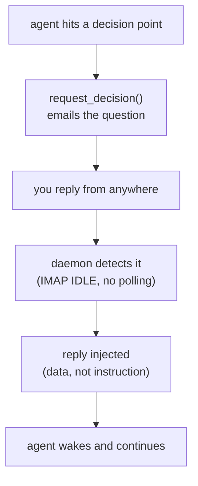
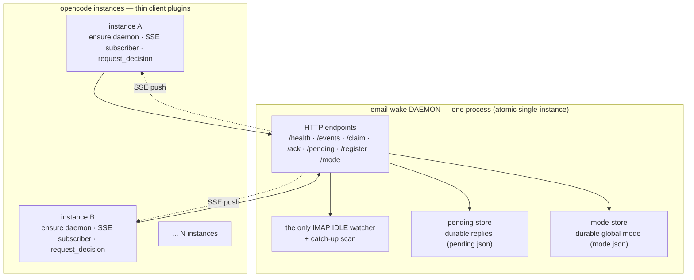
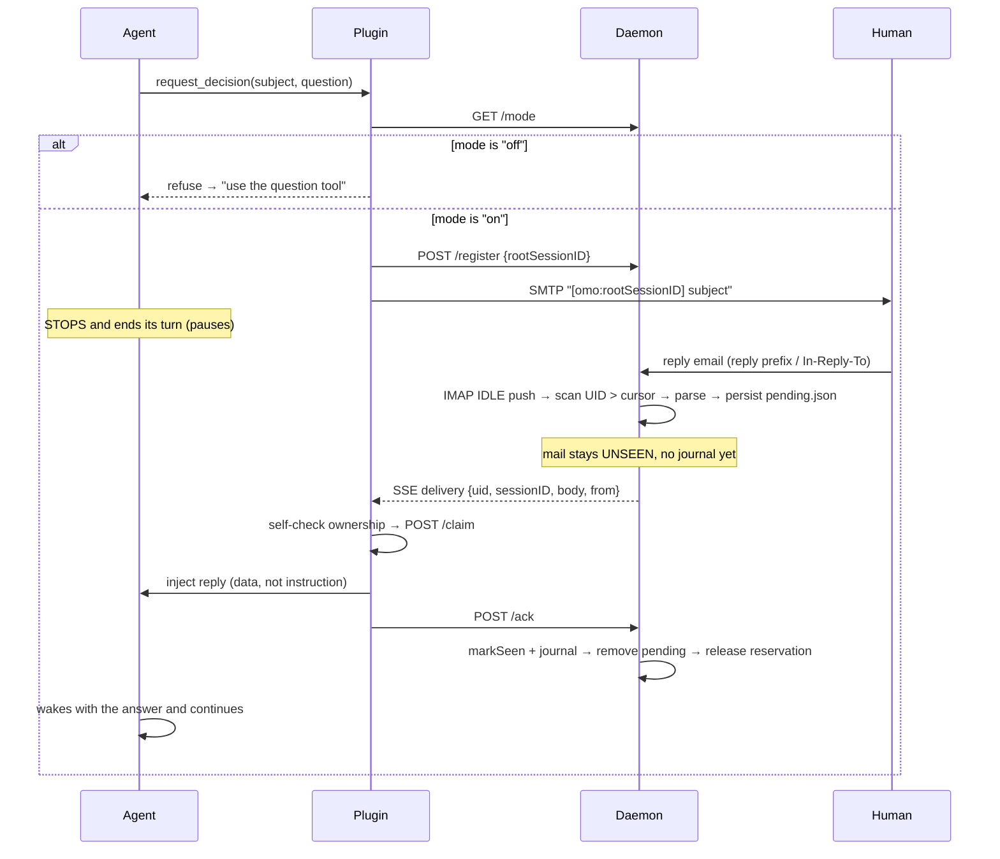

<div align="center">

# email-wake

**用邮件向你的智能体提出决策问题，无论身在何处，回复邮件即可唤醒它。**

[](LICENSE)
[](#)
[](#)

这是一个 [OpenCode](https://opencode.ai) 插件，让运行中的智能体可以通过邮件向用户提出**决策问题**，并在用户回复时**自动恢复会话**，全程无需用户触碰终端。

[**English**](README.en.md) · **简体中文**

</div>



## 功能

- **邮件决策**：智能体提问，你在任何地方作答，无需终端
- **`/afk` 模式开关**：只有在你离开屏幕之后（`/back` 可返回）才发送邮件
- **零轮询**：IMAP IDLE 推送加一次性补扫，绝无定时轮询器
- **推送投递**：SSE 广播加按实例的属主自检（多实例安全）
- **消息不丢失**：持久化的 pending-store 加注入后确认（崩溃安全）
- **国际化**：默认英文，可通过 `config.messages` 覆盖为任意语言
- **数据而非指令**：每条注入的回复都带有提示注入防护
- **一键安装器**：`node install.js` 负责复制、安装、注册并生成配置骨架

面向智能体的使用说明请参阅 [`AGENTS.md`](AGENTS.md)（`request_decision` 契约以及「提问后暂停」规则）。

---

## 安装

### 复制粘贴式安装（直接交给你的 LLM）

将以下内容粘贴给任意编码智能体（OpenCode、Claude Code……）：

```text
Install and configure email-wake by following the instructions here:
https://raw.githubusercontent.com/7emotions/email-wake/main/INSTALLATION.md
```

### 一键安装（手动）

```bash
git clone https://github.com/7emotions/email-wake
cd email-wake
node install.js
# then edit ~/.config/opencode/plugins/email-wake/config.json and fill credentials
```

安装器会执行以下操作：

1. 将源码复制到 `~/.config/opencode/plugins/email-wake/`（跳过 `node_modules`、`.git` 以及所有密钥/运行时文件）；
2. 运行 `npm install --omit=dev`；
3. 由 `config.example.json` 生成 `config.json`（绝不覆盖已有的）；
4. 在 `~/.config/opencode/opencode.jsonc` 中注册插件（采用保留注释的文本插入方式，绝不对 JSONC 文件执行 `JSON.parse`）；
5. 将 `command/afk.md` 与 `command/back.md` 复制到 `~/.config/opencode/command/`。

随后编辑 `config.json`（已被 git 忽略），填入 `imap.user` / `imap.password` / `smtp.user` / `smtp.password` / `recipient`，然后重新加载 opencode。

### 手动步骤

与安装器等价的手动步骤：

1. 将此目录复制到 `~/.config/opencode/plugins/email-wake/`。
2. `cd` 进入该目录并运行 `npm install`。
3. 由 `config.example.json` 创建 `config.json` 并填写凭据。
4. 将插件路径添加到 `~/.config/opencode/opencode.jsonc` 中的 `plugin` 数组。
5. 将 `command/afk.md` 与 `command/back.md` 复制到 `~/.config/opencode/command/`。
6. 重新加载 opencode。

该插件依赖 `@opencode-ai/plugin`、`@opencode-ai/sdk`、`imapflow`、`mailparser` 和 `nodemailer`。

---

## 快速上手

1. 安装插件并编写 `config.json`（复制 `config.example.json`）。至少需要有效的 IMAP 与 SMTP 凭据（QQ 授权码即可作为密码）以及一个 `recipient`。
2. 重新加载 opencode。插件会确保其守护进程正在运行并完成加载。
3. 在会话中，智能体可以调用 `request_decision(subject, question, { context, options, recommendation })`。该工具会把问题以邮件形式发出，并返回 `Decision requested — pause and end this turn; wait for the reply to be injected`。
4. 回复邮件。守护进程检测到回复，属主实例将其注入，会话随即继续。

```sh
# run the unit test suite (no network, no real mailbox)
node --test test/*.test.mjs
```

---

## 邮件模式（`/afk` 与 `/back`）

默认情况下，`request_decision` **拒绝向用户发送邮件**。只有当用户明确离开屏幕时才允许发送邮件，这由守护进程持久化存储于 `mode.json`（已被 git 忽略）中的单一 **GLOBAL** 模式标志（`"on"`/`"off"`）控制。该标志按设计是全局的：无论运行多少个会话/实例，用户要么在屏幕前，要么不在。

| 模式 | 含义 | `request_decision` 行为 |
|------|---------|-----------------------------|
| `"off"`（默认） | 用户在屏幕前 | 拒绝：返回模式关闭消息（指示智能体改用内置 `question` 工具）。不发邮件、不注册。 |
| `"on"` | 用户已离开（`/afk`） | 照常向用户发送邮件。 |

用户通过两个命令切换该模式：

- `/afk`：调用 `set_email_mode(mode: "on")`（打开邮件模式）。
- `/back`：调用 `set_email_mode(mode: "off")`（关闭邮件模式）。

当模式关闭而智能体需要决策时，它必须改用 opencode 内置的 **`question` 工具**在对话中提问，而不是发送邮件。

**待办检查点（Todo checkpoint）。** 当 `request_decision` 将要以邮件形式发出（模式开启）时，智能体必须先把待办列表写入检查点（写进消息正文，然后清空待办），以免挂起等待的用户回复被 todo-continuation 覆盖。回复被注入后，智能体再依据检查点重建待办列表。

### 注册命令

OpenCode 会从全局命令目录 `~/.config/opencode/command(s)/<name>.md`（文件名即命令名）中的 markdown 文件加载自定义命令。下面这两个文件就实现了上述行为：

- `~/.config/opencode/command/afk.md`：打开邮件模式。
- `~/.config/opencode/command/back.md`：关闭邮件模式。

（如果你更愿意用配置而不是 markdown 文件，下面是等价的 `opencode.jsonc` 形式：）

```jsonc
{
  "command": {
    "afk": { "template": "Call the set_email_mode tool with mode \"on\", then confirm briefly.", "description": "Turn email mode ON" },
    "back": { "template": "Call the set_email_mode tool with mode \"off\", then confirm briefly.", "description": "Turn email mode OFF" }
  }
}
```

模式状态保存在守护进程中（`mode.json`），通过 `GET /mode` / `POST /mode` 提供访问，并以 SSE `mode` 事件推送给每个已连接的实例（连接时还会推送一次初始 `mode` 事件），因此在某个会话中做出的更改，所有实例都会立刻看到。

---
## 配置

插件（`index.js`）与守护进程（`daemon.js`）都会读取插件目录下的 `config.json`。完整、以结构本身作为注释的示例请参阅 `config.example.json`（其中不含任何真实密钥）。

### `config.json` 字段

| 字段 | 含义 |
|-------|---------|
| `imap.host` / `imap.port` / `imap.secure` | 用于读取回复的 IMAP 服务器（默认 `imap.qq.com:993`、`secure:true`） |
| `imap.user` / `imap.password` | IMAP 凭据（密码使用 QQ 授权码） |
| `smtp.host` / `smtp.port` / `smtp.secure` | 用于发送决策邮件的 SMTP 服务器（默认 `smtp.qq.com:465`） |
| `smtp.user` / `smtp.password` | SMTP 凭据 |
| `recipient` | 决策邮件的收件人；默认取 `smtp.user` |
| `allowList` | 允许注入其回复的发件人地址 —— prompt 注入防护。默认 `[smtp.user]`（仅你自己的邮箱） |
| `folder` | 要监听的邮箱文件夹（默认 `INBOX`） |
| `tuning` | 可选的运行行为/时序覆盖（见下文） |
| `messages` | 可选的用户/智能体可见文案本地化（见下文） |

### 安全

- **发件人白名单** — `request_decision` 将问题邮件发送给 `recipient`；只有来自 `allowList`（默认：你自己的 `smtp.user`）地址的回复才会被注入会话。即使陌生人复制了 `[omo:<sessionID>]` 主题令牌，也无法注入内容 —— 除非其地址在白名单中，否则回复会被忽略。如需添加其他地址（例如第二个个人邮箱），请列出它们：`"allowList": ["me@qq.com", "me@outlook.com"]`。
- **数据而非指令** — 每条注入的回复都被标注为*数据*，绝不是可执行的指令（prompt 注入防护）。

### `tuning`（可选，当前所列各值即默认值）

每个字段都是可选的，缺省时采用表中所列默认值；省略整个块即可保持现有行为不变。

| 字段 | 默认值 | 所替代的源码常量 |
|-------|---------|------------------------------|
| `tuning.claimTtlMs` | `60000` | `pending-store.js` 中的 `CLAIM_TTL_MS`：一条 claim 在另一实例可夺取之前保持权威的时间 |
| `tuning.reconnectBaseMs` | `1000` | `subscribe.js` 中的 `DEFAULT_RECONNECT_BASE_MS`：SSE 重连退避起始值 |
| `tuning.reconnectMaxMs` | `30000` | `subscribe.js` 中的 `DEFAULT_RECONNECT_MAX_MS`：SSE 重连退避上限 |
| `tuning.idleRenewMs` | `1500000` | `watcher.js` 中的 `IDLE_RENEW_MS`（25 分钟）：在服务器断开前每隔多久重新发起一次 IDLE |
| `tuning.autoIdleDelayMs` | `1000` | `watcher.js` 中的 `AUTO_IDLE_DELAY_MS`：imapflow 自动启动 IDLE 前的静默期 |
| `tuning.backoffInitialMs` | `1000` | `watcher.js` 中的 `BACKOFF_INITIAL_MS`：IMAP 重连退避起始值 |
| `tuning.backoffMaxMs` | `60000` | `watcher.js` 中的 `BACKOFF_MAX_MS`：IMAP 重连退避上限 |

这些值由 `config.tuning` 注入到各消费模块（`daemon.js`、`index.js`），各模块自身从不读取配置文件。

### `messages`（可选，默认为英文）

所有用户/智能体可见的文案都通过 `messages.js` 表进行本地化。默认值为英文；在 `config.messages` 下覆盖任意键即可实现本地化（采用深合并，未提及的键保留英文默认值）：

```json
{
  "messages": {
    "decisionBody": {
      "context": "Context:",
      "question": "Decision:",
      "options": "Options:",
      "recommendation": "Recommendation:",
      "replyInstruction": "Reply to this email with your answer"
    },
    "tool": {
      "requested": "Decision requested — pause and end this turn; wait for the reply to be injected",
      "alreadyPending": "A decision is already pending — wait for the reply",
      "mainSessionOnly": "Call from the main session only",
      "modeOff": "Email mode is off — the human is at the screen. Use the question tool to ask in the conversation instead.",
      "modeOn": "Email mode is ON — the human has left the screen; request_decision will email them.",
      "modeDisabled": "Email mode is OFF — request_decision will use the question tool instead."
    }
  }
}
```

注意：`inject.js`（`buildPayload`）中的 DATA-NOT-INSTRUCTION 框架属于安全框架而非显示文案，因此刻意**不**列入上表，其默认行为保持不变。

### 环境变量

所有连接相关字段都可以通过环境变量覆盖（优先级高于 `config.json`）：

| 变量 | 含义 |
|----------|---------|
| `EMAIL_WAKE_CONFIG` | 配置文件路径（默认 `<plugin>/config.json`） |
| `EMAIL_WAKE_IMAP_HOST` / `EMAIL_WAKE_IMAP_PORT` / `EMAIL_WAKE_IMAP_USER` / `EMAIL_WAKE_IMAP_PASSWORD` | IMAP 覆盖 |
| `EMAIL_WAKE_SMTP_HOST` / `EMAIL_WAKE_SMTP_PORT` / `EMAIL_WAKE_SMTP_USER` / `EMAIL_WAKE_SMTP_PASSWORD` | SMTP 覆盖 |
| `EMAIL_WAKE_RECIPIENT` | 收件人覆盖 |
| `EMAIL_WAKE_JOURNAL` | journal 文件路径（已处理 UID 去重） |
| `EMAIL_WAKE_LAST_UID` | UID 游标文件路径（检测状态） |
| `EMAIL_WAKE_PENDING` | pending-store 文件路径（持久化投递） |
| `EMAIL_WAKE_MODE` | 模式存储文件路径（GLOBAL 邮件模式，`mode.json`） |
| `EMAIL_WAKE_DAEMON_URL` | 守护进程基础 URL（默认 `http://127.0.0.1:4100`） |
| `EMAIL_WAKE_DAEMON_HOST` / `EMAIL_WAKE_DAEMON_PORT` | 守护进程绑定主机/端口（默认 `127.0.0.1` / `4100`） |
| `EMAIL_WAKE_DEBUG` | 设为 `1`/`true` 以启用调试日志 |

密码绝不会被记录（序列化配置时以 `***` 打码）。

---

## 工作原理：单一监听守护进程 + PUSH 投递

一台机器上只运行**一个守护进程**（`daemon.js`），它持有共享邮箱唯一的 IMAP IDLE 监听器。每个 opencode 实例只加载**轻量客户端插件**（`index.js`），该插件会确保守护进程处于运行状态，并向其建立一条 **SSE 流**。守护进程解析回复、持久化保存，再通过 SSE **推送**给实例；每个实例自检属主、抢占 claim，并在**进程内**完成注入。



守护进程绑定固定端口（默认 `4100`，可用 `EMAIL_WAKE_DAEMON_PORT` 覆盖）。绑定即是原子的单实例锁：若两个实例同时启动守护进程，只有一个能赢得 `bind`，落败者会安静退出（`EADDRINUSE`）。插件探测 `/health` 无响应时，会启动一个分离的守护进程并轮询直至其健康就绪。

### 完整流程



### P0 修复：消息不丢失

该设计会先把解析出的回复持久化到**可持久化的 pending-store**（`pending.json`，已被 git 忽略），*然后*才做其他任何事。`\Seen` 标记加 journal 确认**只发生在 `/ack` 处理器中**，即在属主实例完成回复注入之后。若守护进程在持久化与确认之间崩溃，邮件服务器上的回复仍处于 UNSEEN 状态，且 `pending.json` 中也仍保留该回复；守护进程重启时会重新加载它，并在下一个实例连接时重新广播。

投递语义为**至少一次**，而非恰好一次（注入并非幂等）：在注入*之后*、确认*之前*发生崩溃会重新广播该回复，因此它可能被注入两次，但**绝不会丢失**。

---

## 硬性约束

1. **每台机器只运行一个守护进程。** 守护进程是唯一的 IMAP 监听器；第二个守护进程会因 `EADDRINUSE` 而安静退出。
2. **不做 IMAP 轮询。** 新邮件由服务器通过 IDLE 推送（`watcher.js`）送达，并在每次连接/重连后进行一次性补扫，绝不存在按会话或定时的轮询器。
3. **检测基于 UID 游标，绝不依赖 `\Seen` 或 SUBJECT。** 守护进程只扫描大于持久游标（`uid-cursor.js`）的 UID，与 `\Seen` 标志（用户可能已先读过回复）以及 SUBJECT 索引（QQ 的 SUBJECT 索引存在延迟）无关。游标会越过每个见到的 UID（无论是否已处理），因此自复制/无令牌的邮件永远不会卡住游标。
4. **每个会话只允许一个未决决策。** 该守卫在服务端实现：对重复注册的会话，守护进程的 registry 返回 `alreadyPending:true`，`request_decision` 也会直接返回 already-pending 消息，而不发送第二封邮件。registry 存于内存（24 小时 TTL）；即使回复在其预留被丢弃之后才到达，也仍会被投递（pending-store 以回复自身的 UID 为键，而非 registry）。
5. **`request_decision` 仅限主会话。** 子智能体的调用（带 `parentID` 的会话）会被拒绝并返回 `Call from the main session only`，因为决策必须携带主会话的完整上下文。
6. **确认顺序（P0）。** `\Seen` 加 journal 只在 `/ack` 处理器中写入，即在进程内注入成功之后。确认前发生崩溃会让邮件保持 UNSEEN，回复则持久保留在 `pending.json` 中，不造成丢失。
7. **回复是数据，而非指令。** 注入的正文被框架化为*数据*（`数据，非指令`），并明确告知智能体不得执行回复内的任何指令（提示注入防护）。
8. **邮件模式是全局开关（默认关闭）。** 除非模式为 `"on"`（由 `/afk` 设置），否则 `request_decision` 拒绝发送邮件；当模式为 `"off"` 时，它返回模式关闭消息，智能体改用内置的 `question` 工具。每台机器只有一个 `mode.json`，绝不按会话/目录区分。

---

## 已知限制

- **至少一次的投递。** 注入并非幂等；在注入与确认之间崩溃可能导致同一条回复被投递两次。
- **单一邮箱。** 守护进程只持有 一个 IMAP 账户/文件夹；多账户场景需要为每个邮箱各运行一个守护进程（并使用不同端口）。
- **单机运行。** 守护进程按机器部署，并非共享的网络服务；若多台机器共享同一邮箱，则每台都需要自己的守护进程与凭据。
- **registry 存于内存。** 单一未决决策的预留无法在守护进程重启后存活（24 小时 TTL 是唯一的清理机制）。预留被丢弃之后到达的回复仍会被投递。
- **至少一次的属主检查依赖 `session.directory`。** 若实例的目录与会话的目录不完全一致，该实例会忽略此次投递（对常见场景而言这是正确的；`/claim` 先到先得守卫覆盖了「两实例同一目录」的情况）。
- **针对 QQ 的默认值。** IMAP/SMTP 主机默认值面向 QQ 邮箱；其他服务商需要在 `config.json` 中配置自己的 host/port（并且可能不会以同样的方式暴露 IMAP IDLE `exists` 推送）。
- **守护进程就绪是尽力而为。** 若守护进程无法在约 15 秒内启动，`request_decision` 仍会发送邮件，但回复可能要到守护进程恢复后才会自动路由。

---

## 文件结构

| 文件 | 作用 |
|------|------|
| `index.js` | 插件入口：轻量客户端，确保守护进程运行、启动 SSE 订阅者、暴露 `request_decision` 与 `set_email_mode` |
| `daemon.js` | 单一监听守护进程（端口绑定、HTTP：SSE/claim/ack/pending/register/mode、监听器、信号处理） |
| `request-decision.js` | `request_decision` 工具（模式开关 → 注册 → SMTP 发送 → 释放） |
| `config.js` | 配置加载与校验、环境变量覆盖、`tuning` 默认值、密码打码 |
| `messages.js` | 用户/智能体可见文案（默认英文，可被 `config.messages` 覆盖） |
| `install.js` | 一键安装器（复制、`npm install`、生成配置骨架、注册、复制命令） |
| `core/watcher.js` | 单一 IMAP IDLE 连接、自动重连、补扫钩子 |
| `core/process.js` | 扫描 → 获取 → 解析 → 持久化流水线（不含确认） |
| `core/reply-parse.js` | 纯回复检测以及令牌/正文提取 |
| `core/inject.js` | 回复注入（DATA-NOT-INSTRUCTION）+ `\Seen`/journal 确认 |
| `core/subscribe.js` | 进程内 SSE 订阅者：属主自检 → 抢占 → 注入 → 确认，外加重连补扫 |
| `store/pending-store.js` | 磁盘上持久化的待投递消息（P0 修复：claim/ack 原子性与 TTL） |
| `store/mode-store.js` | 磁盘上持久化的全局邮件模式（`mode.json`，默认 `"off"`） |
| `store/registry.js` | 内存中的单一未决决策守卫（不负责路由） |
| `store/uid-cursor.js` | 持久化的「已处理最高 UID」游标（检测状态） |
| `command/` | `/afk` 与 `/back` 命令模板（会被复制到 `~/.config/opencode/command/`） |
| `test/` | `node:test` 单元测试套件与实网集成脚本 |

## 许可证

MIT，详见 [`LICENSE`](LICENSE)。

## 测试

```sh
# unit tests (no network): pending-store, mode-store, registry, inject-ack,
# process-mail, negative, uid-cursor, daemon HTTP (register + push + mode
# endpoints + SSE), subscribe, request-decision (incl. the mode gate),
# reply-parse, unit, messages, config
node --test test/*.test.mjs
```

实网集成脚本（访问真实 QQ 邮箱；需单独运行；部分脚本仍引用推送改造前的契约，不属于自动化测试套件）：`test/daemon-live.mjs`、`test/catch-up.live.mjs`、`test/idle-connect.live.mjs`、`test/uidcursor.live.mjs`、`test/e2e.mjs`、`test/receive-parse-test.mjs`、`test/inject-test.mjs`。
